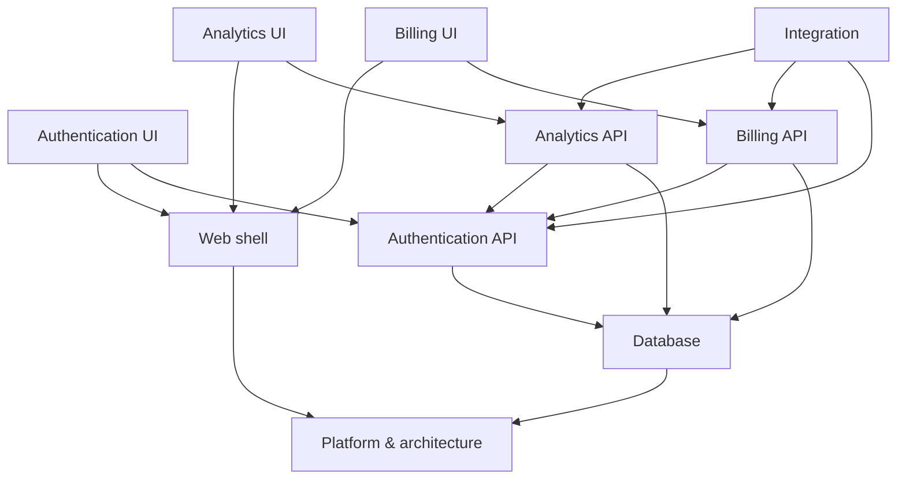

# Architecture

## Components

| Component | Paths |
|---|---|
| Platform & architecture | `.wbi/**`, `docs/**` |
| Database | `src/db/**`, `migrations/**` |
| Web shell | `src/web/shell/**`, `src/web/components/**` |
| Authentication API | `src/api/auth/**` |
| Authentication UI | `src/web/auth/**` |
| Billing API | `src/api/billing/**` |
| Billing UI | `src/web/billing/**` |
| Analytics API | `src/api/analytics/**` |
| Analytics UI | `src/web/analytics/**` |
| Integration | `tests/e2e/**` |

## Contracts

| Contract | Kind | Provided by | Shape |
|---|---|---|---|
| `Session` | type | TASK-004 | `{ userId: string; tenantId: string; expiresAt: string }` |
| `POST /api/auth/login` | http | TASK-004 | `body { email, password } → 200 { session: Session } \| 401` |
| `BillingStatus` | type | TASK-007 | `'active' \| 'past_due' \| 'canceled'` |
| `GET /api/billing` | http | TASK-007 | `→ 200 { status: BillingStatus; plan: string; renewsAt: string }` |
| `AnalyticsEvent` | event | TASK-010 | `{ name: string; tenantId: string; at: string; props: Record<string, unknown> }` |
| `GET /api/analytics/summary` | http | TASK-010 | `→ 200 { series: { day: string; count: number }[] }` |

## Decisions

- **ADR-001** Contract-first parallel development _(accepted)_: Backend and UI tasks are decoupled by explicit contracts so humans and agents can work in parallel; changing a contract is a tracked event that propagates to consumers.
- **ADR-002** Stack to be chosen in the architecture task _(proposed)_: No framework was detected in the repository.
